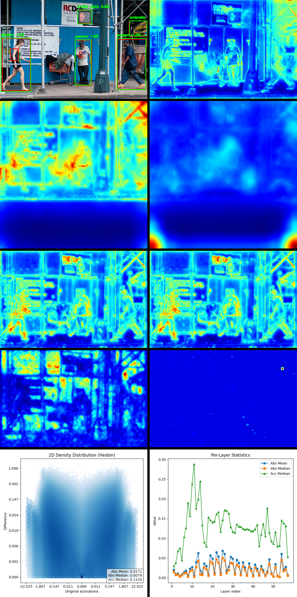
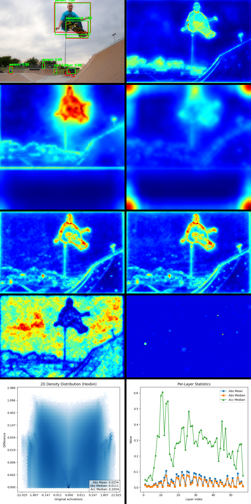
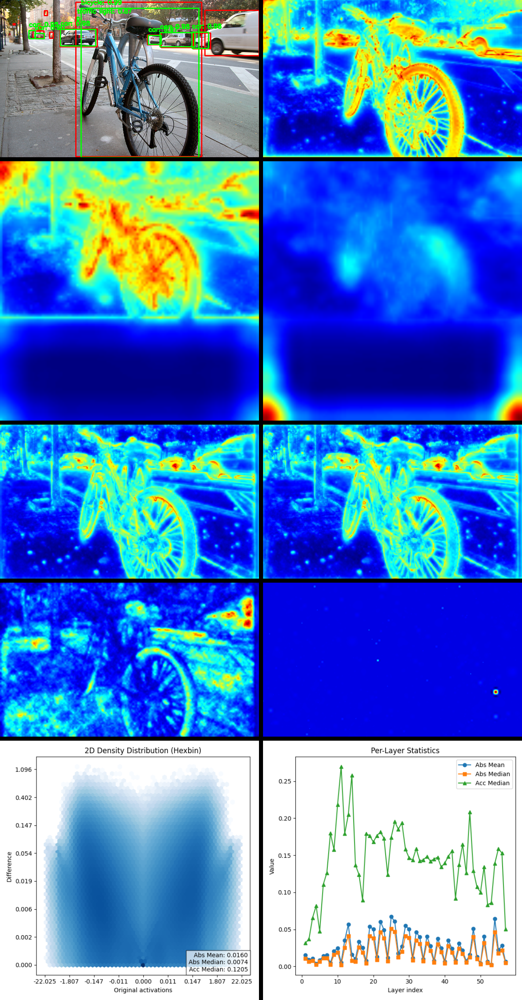

## Abstract

Convolutional neural networks operate on high-dimensional visual representations, where final activations can vary significantly even when final predictions remain stable. This makes validation of post-training quantization challenging, as standard accuracy metrics often fail to capture underlying deviations. 

In this work, we analyze the effect of INT8 quantization on a Faster R-CNN model trained on the COCO dataset using ONNX. By collecting and comparing intermediate convolutional activations, we observe that although detection accuracy remains largely unchanged, internal feature maps exhibit measurable differences. The median relative error in the final convolutional layer was found to be 4–6%.

We further show that the error propagation trend across layers is consistent across different input images, suggesting that full dataset evaluation is not always necessary. Additionally, quantization error is significantly lower within detected object regions, while increasing error correlates with bounding box distortion and eventual detection failure.

## Introdution

Convolutional neural networks (CNNs) have become the dominant approach in computer vision, powering tasks such as image classification and object detection. In practical deployments, these models are often optimized for performance through techniques such as post-training quantization, which reduces computational cost and memory usage. However, evaluating the impact of quantization remains a challenging problem.

Most existing validation approaches rely on output-level metrics such as accuracy or mean average precision (mAP). While these metrics are useful, they often fail to capture subtle but important changes in the internal behavior of convolutional models. This is particularly relevant for detection architectures such as Faster R-CNN, where predictions depend on complex intermediate feature representations rather than a single classification output.

Unlike classification models, where the final layer operates on relatively structured inputs, convolutional feature maps represent a high-dimensional and spatially complex view of the input. As a result, quantization errors may propagate through the network in non-trivial ways, without immediately affecting final predictions. This creates a gap between observed accuracy and actual internal model behavior.

In this work, we address this gap by analyzing intermediate convolutional activations in quantized models. Using a Faster R-CNN model trained on the COCO dataset and exported to ONNX, we compare FP32 and INT8 representations across multiple layers. We show that, despite similar detection performance, measurable differences emerge in feature distributions, with median errors of 4–6% in deeper layers.

Furthermore, we demonstrate that error propagation follows consistent trends across input images, and that quantization error is significantly lower within detected object regions. Our findings suggest that feature-level analysis provides a more reliable tool for validating quantized models than output metrics alone.

The remainder of this paper is structured as follows: Section 2 describes the proposed methodology, Section 3 presents and analyzes the results, and Section 4 concludes with key findings and future directions.

## Methodology

This section presents the methodology used to analyze quantization-induced differences in convolutional neural networks. Our approach consists of exporting trained models to ONNX format, extracting intermediate activations, and comparing floating-point (FP32) and quantized (INT8) representations across layers.

To capture internal network behavior, intermediate outputs can be obtained either via PyTorch forward hooks or directly from ONNX model outputs. In this work, both approaches are applicable; however, ONNX-based extraction enables consistent comparison between original and quantized models. While exporting models such as YOLO, EfficientNet, and DenseNet to ONNX is straightforward, Faster R-CNN requires special handling. We separate the model into a feature extractor and a detection head to enable quantization of the convolutional backbone independently. If both the batch size and input image dimensions are fixed, the full model can be exported directly; otherwise, input preprocessing must be handled explicitly to ensure compatibility.

To make convolutional activations visually interpretable, feature maps must be reduced to a spatial representation. Convolutional layers produce multi-channel outputs, where each channel corresponds to a learned feature detector. Instead of averaging across channels, we compute the channel-wise maximum at each spatial location. This emphasizes the strongest activation, corresponding to the best-matching feature, which is more informative than average responses. Additionally, since max pooling layers aggregate information over spatial regions, this effect is implicitly reflected in the extracted activations. The procedure can be applied to all layers or a selected subset; in our experiments, all layers are included with equal weighting.

For quantitative analysis, the FP32 model serves as the reference baseline. In our case, this is a Faster R-CNN model trained on the COCO dataset. To analyze activation differences, we construct hexbin plots where the horizontal axis represents original FP32 activations and the vertical axis shows the corresponding differences. Due to the non-uniform spacing of floating-point values—where precision decreases with increasing magnitude—compared to the uniform spacing of integer representations, careful visualization is required. We apply logarithmic density scaling to highlight both dense and sparse regions. Furthermore, symmetric logarithmic (symlog) transformations are used on both axes and data to properly handle values near zero and negative ranges, resulting in a fully logarithmic representation of the distribution.

To summarize error propagation across layers, we define metrics based on activation differences. Both absolute and relative differences are computed, along with their mean and median values. However, relative error metrics are highly sensitive to values near zero, which can lead to instability; therefore, the median is considered more reliable in this case. These metrics allow us to model how quantization error accumulates throughout the network, with particular emphasis on deeper layers and the final feature representations.

In the following section, we present experimental results and concrete examples illustrating the observed error patterns and their impact on model behavior.

## Results

**Figure X:** Visualization of convolutional activations and quantization effects across multiple models. In this example, all convolutional layers are included in the visualization.

From left to right and top to bottom, the images show: (1) Faster R-CNN INT8 predictions alongside ground truth annotations, (2) YOLO feature maps, (3) EfficientNet feature maps, (4) DenseNet feature maps, (5) Faster R-CNN FP32 feature maps, (6) Faster R-CNN INT8 feature maps, (7) absolute differences between FP32 and INT8 activations, (8) relative differences, (9) activation differences visualized using hexbin plots, and (10) layer-wise error propagation across the network.

The figure illustrates how quantization affects internal feature representations while preserving overall detection performance.

Where actual objects are present, the absolute differences between the FP32 and INT8 models are minimal, appearing as dark blue regions in the visualization. This color-coding effectively highlights the areas corresponding to objects, such as people or traffic lights, making them visually distinguishable. In contrast, larger differences occur predominantly in the background, which do not affect detection since the linear layers interpret these as negligible noise.

Feature maps reveal the patterns detected by the network, which may not always correspond to real objects. In DenseNet, the subsequent linear layers after the convolutional stages modify the feature map’s appearance compared to EfficientNet; however, the convolutional patterns before the first linear layer remain similar.

The distribution of errors and their layer-wise trends are consistent across images, with only absolute values varying. The median error in the final convolutional layer is 4–6%, while across all layers, the cumulative error ranges from 9–20%. In this particular example, these values are approximately 5% and 11%, respectively. Notably, relative median errors tend to decrease across layers rather than accumulate, indicating that quantization-induced discrepancies do not propagate through the network. Operations such as convolution, max-pooling, and batch normalization contribute to this attenuation by emphasizing the most relevant features while suppressing less informative activations, ensuring robust multi-level object detection even after INT8 quantization.

**Figure X:** Visualization of convolutional activations and quantization.

In this example, the activation differences are again primarily observed outside the actual object regions. A slight misprediction can be seen to the right of the base of the traffic light pole, where a brighter patch appears on the feature map representing the differences. In this case, the error in the final convolutional layer was approximately 4%, while the cumulative error across all layers reached around 20%, primarily due to background activations rather than errors over the objects themselves.

**Figure X:** Visualization of convolutional activations and quantization.

In this final example, the feature map depicting activation differences shows that the bicycle bounding box is slightly shifted, yet the object is still correctly detected. On the right-hand side, however, the accumulated differences between the two models were sufficient to prevent detection. Interestingly, even the FP32 model failed to detect the object there, despite the annotation indicating its presence.

Additional examples, including visualizations for fewer or alternative layers, can be explored in the implementation on GitHub: [Github](https://github.com/EgyipTomi425/EchteAI/blob/master/Python/EchteAI/examples/vision/coco_frcnn_yolo_efffi_dense)

## Conclusion

Conclusion

In this study, we systematically analyzed the effects of post-training INT8 quantization on convolutional neural networks, focusing on object detection with Faster R-CNN on the COCO dataset. By comparing intermediate activations between FP32 and quantized models, we were able to measure quantization-induced deviations even when standard output metrics remained unchanged. Deviations within actual object regions are consistently minimal when the model is correctly quantized; larger deviations lead to bounding box misalignment or detection failure. Background regions may exhibit larger deviations without affecting outputs. Median final-layer errors ranged from 4–6%, with cumulative multi-layer errors between 9–20%.

Critically, the observed error propagation trends were consistent across images, enabling reliable quantification of quantization effects without iterating over the entire dataset. The methodology—leveraging ONNX extraction, channel-wise maxima, and hexbin visualizations—provides a robust framework for assessing and validating quantized CNNs, supporting deployment decisions and further architectural optimization.