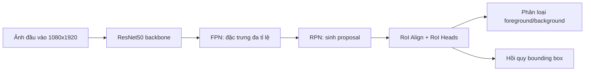
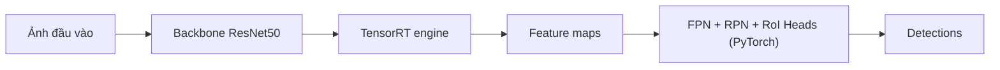

# SeaDronesSee ResNet50 Faster R-CNN Pipeline

## Demo

Video so sánh trực quan giữa hai nhánh:

- trái: `FP32 full PyTorch`
- phải: `INT8 hybrid` với backbone TensorRT

[Tải video demo](./video_fp32_full_vs_int8_hybrid_ve2.mp4)

## 1. Giới thiệu

Nhánh này triển khai bài toán phát hiện vật thể trên ảnh biển với kiến trúc Faster R-CNN sử dụng backbone ResNet50 kết hợp FPN. Mục tiêu của pipeline là xây dựng một baseline FP32 sạch, sau đó mở rộng sang Quantization-Aware Training (QAT) và triển khai tăng tốc theo hướng TensorRT cho riêng phần backbone.

Khác với nhánh cũ, pipeline hiện tại tập trung vào cấu hình ResNet50 với đầu vào độ phân giải cao `1080x1920`, đồng thời rút gọn bài toán phân loại về `2 class`: `background` và `foreground`. Tất cả đối tượng hợp lệ trong dữ liệu được gom về cùng một lớp foreground để ưu tiên khả năng phát hiện có-vật-thể trong bối cảnh vật thể rất nhỏ, mật độ thấp và nền biển có nhiều nhiễu.

## 2. Kiến trúc tổng thể

Mô hình hiện tại sử dụng kiến trúc Faster R-CNN hai giai đoạn. Ảnh đầu vào được đưa qua backbone ResNet50 để trích xuất đặc trưng không gian. Các đặc trưng ở nhiều mức sâu khác nhau được tổng hợp bởi Feature Pyramid Network (FPN) nhằm tạo ra biểu diễn đa tỉ lệ phù hợp với bài toán vật thể nhỏ. Sau đó, Region Proposal Network (RPN) sinh các vùng đề xuất, và RoI Heads thực hiện phân loại cuối cùng cùng với hồi quy hộp giới hạn.

Luồng xử lý có thể mô tả như sau:

## 3. Thiết kế backbone ResNet50-FPN

Backbone của mô hình là `ResNet50` pretrained, sau đó được gắn với FPN để tạo ra đặc trưng đa tỉ lệ. Trong cấu hình hiện tại:

- `backbone = resnet50`
- `trainable_backbone_layers = 5`
- `fpn_out_channels = 256`

Giá trị `trainable_backbone_layers = 5` có nghĩa là toàn bộ backbone ResNet50 được fine-tune, không đóng băng các stage chính. Đây là cấu hình full fine-tune của backbone, phù hợp khi dữ liệu đích khác đáng kể so với dữ liệu tiền huấn luyện.

FPN đóng vai trò quan trọng trong bài toán này vì vật thể trên mặt biển thường rất nhỏ so với khung hình. Nếu chỉ dùng đặc trưng sâu ở một mức duy nhất, nhiều chi tiết nhỏ sẽ bị mất. Việc tổng hợp đặc trưng theo nhiều scale giúp detector vừa giữ được chi tiết cục bộ, vừa có đủ ngữ cảnh để phân biệt vật thể với nền sóng, bọt nước và phản xạ ánh sáng.

## 4. Cấu hình đầu vào và anchor box

Pipeline hiện tại làm việc ở độ phân giải cao:

- `min_size = 1080`
- `train_min_sizes = [1080]`
- `max_size = 1920`

Đây là lựa chọn có chủ đích để giữ lại tối đa chi tiết của vật thể nhỏ. Trong các cảnh biển, đối tượng như người bơi, phao hay thiết bị cứu sinh có thể chỉ chiếm một vùng rất nhỏ của ảnh; nếu resize xuống quá thấp thì tín hiệu sẽ suy giảm mạnh.

Một điểm khác biệt quan trọng của nhánh này là anchor box không dùng bộ cố định mặc định. Thay vào đó, anchor được suy ra tự động từ thống kê bounding box của tập huấn luyện sau khi resize theo đúng cấu hình detector hiện tại. Với nhánh ResNet50 này, hệ thống đang sinh ra bộ anchor điển hình:

- `[9, 17, 29, 52, 118]`

Cách tiếp cận này giúp anchor bám sát phân bố kích thước vật thể thực tế trong dữ liệu hơn so với bộ anchor chuẩn kiểu `(32, 64, 128, 256, 512)`.

## 5. Thiết kế bài toán 2 class

Thay vì giữ nguyên toàn bộ lớp gốc của SeaDronesSee, pipeline hiện tại sử dụng:

- `background`
- `foreground`

Điều này được thực hiện thông qua cơ chế `binary_collapse_foreground`, trong đó mọi lớp vật thể hợp lệ đều được ánh xạ về cùng một nhãn foreground.

Mục đích của thiết kế này là giảm độ khó của đầu ra phân loại, để mô hình tập trung trước tiên vào câu hỏi quan trọng nhất: vùng nào thực sự chứa vật thể. Đây là hướng phù hợp khi mục tiêu chính là phát hiện mục tiêu nhỏ trong môi trường nền phức tạp. Tuy nhiên, cách gom lớp này cũng có nhược điểm: mô hình dễ học theo kiểu “có gì đó giống vật thể” mà không cần phân biệt loại vật thể, nên nếu chưa được huấn luyện đủ ổn định thì false positive có thể tăng.

## 6. RPN và cơ chế sinh proposal

RPN hoạt động trên đặc trưng FPN để sinh các vùng ứng viên. Ở nhánh hiện tại, các proposal được giữ tương đối nhiều để ưu tiên recall cho vật thể nhỏ. Cấu hình chính gồm:

- `rpn_pre_nms_top_n_train = 2000`
- `rpn_pre_nms_top_n_test = 1000`
- `rpn_post_nms_top_n_test = 1000`

Thiết kế này giúp hạn chế việc bỏ sót vật thể nhỏ ở giai đoạn đầu, nhưng đồng thời cũng làm tăng số proposal nhiễu nếu confidence của mô hình chưa đủ sạch. Vì vậy, hiệu quả cuối cùng phụ thuộc nhiều vào chất lượng của nhánh phân loại và hồi quy ở RoI Heads.

## 7. Thiết kế hàm loss

### 7.1. Tổng loss của mô hình

Tổng loss của detector được xây dựng từ bốn thành phần:

\[
L = L_{rpn\_cls} + L_{rpn\_box} + L_{roi\_cls} + L_{roi\_box}
\]

Trong đó:

- \(L_{rpn\_cls}\): loss phân loại objectness của RPN
- \(L_{rpn\_box}\): loss hồi quy bbox của RPN
- \(L_{roi\_cls}\): loss phân loại ở RoI Heads
- \(L_{roi\_box}\): loss hồi quy bbox cuối cùng ở RoI Heads

Nhánh hiện tại không giữ nguyên cross-entropy mặc định của Faster R-CNN cho phần classification. Thay vào đó, loss phân loại đã được chuyển sang Focal Loss, còn phần hồi quy bbox vẫn dùng Smooth L1 Loss.

### 7.2. Focal Loss cho phân loại

Focal Loss được sử dụng để giảm ảnh hưởng của các mẫu dễ và tập trung hơn vào các mẫu khó, đặc biệt hữu ích trong bối cảnh mất cân bằng mạnh giữa nền biển và vật thể nhỏ.

#### a. Sigmoid Focal Loss ở RPN

Đối với nhánh objectness của RPN, loss có dạng:

\[
FL(p_t) = \alpha_t (1 - p_t)^\gamma \cdot BCE
\]

Trong đó:

- \(BCE\) là binary cross entropy with logits
- \(p_t\) là xác suất dự đoán đúng của mẫu hiện tại
- \(\gamma\) là hệ số điều tiết mức tập trung vào mẫu khó
- \(\alpha_t\) là hệ số cân bằng giữa positive và negative

Ý nghĩa trực quan của công thức này là:

- nếu mẫu đã được dự đoán đúng với xác suất cao, loss sẽ bị giảm mạnh
- nếu mẫu khó hoặc bị dự đoán sai, loss vẫn giữ lớn để mô hình tiếp tục học

Với dữ liệu biển, số lượng vùng nền lớn hơn rất nhiều số vùng chứa vật thể. Nếu dùng BCE thông thường, các mẫu nền dễ sẽ chi phối quá mạnh quá trình tối ưu. Focal Loss giúp giảm hiệu ứng này.

#### b. Softmax Focal Loss ở RoI Heads

Ở RoI Heads, loss phân loại được xây dựng trên cross entropy từng mẫu rồi nhân thêm hệ số focal:

\[
FL = (1 - p_t)^\gamma \cdot CE
\]

Nếu có hệ số \(\alpha\), foreground và background sẽ được cân bằng bằng các trọng số khác nhau. Điều này giúp RoI Heads tập trung nhiều hơn vào những proposal khó, thay vì bị lấn át bởi các proposal nền quá dễ.

### 7.3. Smooth L1 Loss cho hồi quy bbox

Cả RPN và RoI Heads đều dùng Smooth L1 Loss cho nhánh hồi quy bbox. Công thức có dạng:

\[
\text{SmoothL1}(x)=
\begin{cases}
\frac{0.5x^2}{\beta}, & |x| < \beta \\
|x| - 0.5\beta, & |x| \ge \beta
\end{cases}
\]

Trong đó \(x\) là sai số giữa bbox dự đoán và bbox mục tiêu.

Trong pipeline hiện tại, tham số:

\[
\beta = \frac{1}{9}
\]

Ý nghĩa của Smooth L1 là:

- khi sai số nhỏ, loss có dạng gần giống L2, giúp gradient mượt và ổn định
- khi sai số lớn, loss chuyển sang gần giống L1, giúp ít bị outlier chi phối quá mạnh

Điều này rất phù hợp với hồi quy bounding box, vì các proposal sai lệch nhiều ở giai đoạn đầu là bình thường. Nếu dùng L2 thuần, gradient có thể bị kéo quá mạnh bởi một số proposal rất xấu.

## 8. FP32 baseline, QAT và triển khai hybrid

Nhánh hiện tại hỗ trợ ba mức vận hành chính.

### 8.1. FP32 full PyTorch

Đây là đường chuẩn để huấn luyện và đánh giá chất lượng mô hình. Toàn bộ detector, từ backbone đến RPN và RoI Heads, đều chạy trong PyTorch. Kết quả trên nhánh này được xem là mốc tham chiếu chính.

### 8.2. QAT eager selective

Sau khi có baseline FP32, mô hình được mở rộng theo hướng Quantization-Aware Training. Ở nhánh eager selective, fake-quant chỉ được chèn vào các vùng được chọn trong mạng, thay vì lượng tử hóa toàn bộ detector. Mục tiêu là giảm sai lệch chất lượng khi chuyển sang mô hình nén.

### 8.3. Hybrid TensorRT backbone-only

Đường triển khai hiện tại chưa phải detector INT8 end-to-end hoàn chỉnh. Thay vào đó, chỉ riêng backbone được export và build bằng TensorRT:

- `FP32 hybrid`: backbone chạy TensorRT FP32, phần còn lại vẫn là PyTorch
- `INT8 hybrid`: backbone chạy TensorRT INT8, phần còn lại vẫn là PyTorch/QAT

Thiết kế này cho phép đánh giá riêng tác động của quantization và compiler lên phần backbone, là phần thường chiếm chi phí tính toán lớn nhất.

### 8.4. Thiết kế triển khai TensorRT

Trong nhánh hiện tại, TensorRT chỉ được áp dụng cho phần backbone ResNet50, còn FPN, RPN và RoI Heads vẫn chạy trong PyTorch. Vì vậy đây là một kiến trúc `backbone-only hybrid`, không phải detector TensorRT end-to-end.

TensorRT là bộ tối ưu suy luận của NVIDIA dành cho GPU. Nó không phải là một mô hình mới và cũng không tham gia vào quá trình huấn luyện. Vai trò của TensorRT là nhận mô hình đã train xong, tối ưu graph tính toán và build thành một engine để suy luận nhanh hơn khi triển khai. Trong nhánh hiện tại, TensorRT chỉ được áp dụng cho phần backbone ResNet50, còn các phần như FPN, RPN và RoI Heads vẫn chạy bằng PyTorch.

Luồng xử lý của nhánh hybrid có thể mô tả như sau:

Thiết kế này được chọn vì backbone là phần nặng nhất về tính toán, trong khi các thành phần như proposal generation, RoI Align và postprocess của Faster R-CNN khó ghép thành một graph TensorRT hoàn chỉnh. Bằng cách chỉ tách backbone sang TensorRT, hệ thống có thể đánh giá lợi ích tăng tốc một cách thực dụng và ổn định hơn.

Hiện tại có hai chế độ triển khai:

- `FP32 hybrid`: backbone chạy bằng TensorRT FP32, phần còn lại vẫn là PyTorch.
- `INT8 hybrid`: backbone chạy bằng TensorRT INT8, phần còn lại vẫn là PyTorch/QAT.

Với `FP32 hybrid`, thường không cần train lại, vì trọng số backbone vẫn giữ ở FP32 và chỉ thay đổi backend thực thi. Ngược lại, với `INT8 hybrid`, mô hình cần đi qua bước QAT trước khi export. Lý do là khi backbone bị lượng tử hóa, phân bố đặc trưng đầu ra thay đổi, làm ảnh hưởng đến FPN, RPN và RoI Heads ở phía sau. Nếu không có bước huấn luyện thích nghi, chất lượng có thể giảm rõ rệt.

Tóm lại:

- `FP32 -> TensorRT FP32`: thường không cần train lại.
- `FP32 -> TensorRT INT8`: cần QAT trước khi export để mô hình thích nghi với đặc trưng đã lượng tử hóa.

## 9. Tóm tắt ưu điểm và hạn chế của kiến trúc hiện tại

### Ưu điểm

Kiến trúc hiện tại có một số lợi thế rõ ràng. Thứ nhất, ResNet50-FPN là một backbone ổn định, dễ huấn luyện và có hệ sinh thái triển khai tốt hơn các kiến trúc thử nghiệm hơn. Thứ hai, việc sử dụng ảnh độ phân giải cao và anchor suy ra từ dữ liệu giúp mô hình phù hợp hơn với bài toán phát hiện vật thể nhỏ trên biển. Thứ ba, Focal Loss giúp giảm tác động của mất cân bằng giữa foreground và background, là vấn đề rất rõ trong bài toán này. Cuối cùng, việc tách riêng đường hybrid TensorRT backbone-only giúp dễ đánh giá lợi ích tăng tốc trước khi tiến tới một đường deploy hoàn chỉnh hơn.

### Hạn chế

Bên cạnh đó, kiến trúc hiện tại vẫn có các hạn chế cần nêu rõ. Việc gộp toàn bộ vật thể thành một lớp foreground giúp đơn giản hóa bài toán nhưng cũng làm mô hình dễ sinh false positive nếu chưa train đủ chín. Đường hybrid hiện tại chưa phải là detector TensorRT end-to-end, nên số liệu tốc độ và chất lượng ở chế độ hybrid không nên so trực tiếp với FP32 full PyTorch mà không nêu rõ bối cảnh. Ngoài ra, do đối tượng rất nhỏ và nền biển nhiều nhiễu, mô hình vẫn nhạy với lựa chọn threshold, quality checkpoint và độ ổn định của nhánh hồi quy bbox.

## 10. Kết quả thực nghiệm

Các kết quả dưới đây được đo trên `100 sample` của tập test. Trong đó, cấu hình `FP32 full` là detector chạy hoàn toàn bằng PyTorch, còn hai cấu hình `INT8 QAT epoch 1` và `INT8 QAT epoch 2` là đường triển khai hybrid với backbone TensorRT INT8. Cột `Speedup` được tính theo tỉ lệ tốc độ so với baseline `FP32 full`, cụ thể:

\[
\text{Speedup} = \frac{\text{FPS của cấu hình hiện tại}}{\text{FPS của FP32 full}}
\]

| Metric | FP32 full | INT8 QAT epoch 1 | INT8 QAT epoch 2 |
|---|---:|---:|---:|
| mAP@50:95 | 0.4328 | 0.3693 | 0.3781 |
| mAP@50 | 0.7149 | 0.6300 | 0.6443 |
| AP small | 0.1019 | 0.0943 | 0.0854 |
| AP medium | 0.1745 | 0.1530 | 0.1619 |
| AP large | 0.3613 | 0.3144 | 0.3172 |
| Precision | 0.6519 | 0.8182 | 0.6431 |
| Recall | 0.7130 | 0.5710 | 0.6314 |
| Accuracy | 0.5164 | 0.5067 | 0.4676 |
| Mean IoU | 0.8014 | 0.8051 | 0.7961 |
| F1 | 0.6811 | 0.6726 | 0.6372 |
| Avg inference (ms/img) | 220.4003 | 183.2253 | 177.5467 |
| FPS | 4.5372 | 5.4578 | 5.6323 |
| Speedup vs FP32 full | 1.0000× | 1.2029× | 1.2414× |

Kết quả cho thấy hai cấu hình INT8 đều cải thiện tốc độ suy luận so với baseline FP32 full trên cùng 100 sample. Cụ thể, bản INT8 sau QAT epoch 1 đạt khoảng `1.20×` tốc độ của FP32 full, còn bản INT8 sau QAT epoch 2 đạt khoảng `1.24×`. Đổi lại, các chỉ số mAP tổng thể vẫn thấp hơn baseline FP32 full, nhưng mức suy giảm chưa quá lớn so với lợi ích tăng tốc đạt được. Trong hai cấu hình INT8, bản sau epoch 2 cho kết quả cân bằng hơn giữa chất lượng và tốc độ.
